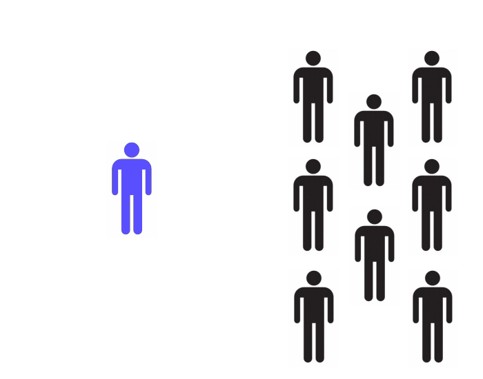

!SLIDE
# Stéphanie
## RH spécialisée en acquisition de compétences
# :-|
### &#8220; Pour atteindre l'expertise, il faut des heures de pratique délibérée, ce qui est différente de l’expérience acquise au jour le jour. Cela consiste à pratiquer en se concentrant sur l'apprentissage, et nécessite de ralentir. Il faut pouvoir expérimenter dans un contexte sûr, et prendre le temps d'analyser comment s'améliorer. Un oeuil extérieur aide. &#8221;

!SLIDE subsection
# Coding Dojo

!SLIDE bullets incremental
# Lieu d'entraînement
* On vient pour apprendre

!SLIDE bullets incremental
# Sûr
* On peut se tromper
* On peut ne pas savoir

!SLIDE bullets incremental
# Ouvert
* A l'extérieur
* Tous niveaux

!SLIDE bullets incremental
# Participants
* apprendre
* partager
* s'amuser

!SLIDE
# TDD
## TODO INSERT schéma 3 étapes

!SLIDE
# Kata
## TODO Plan séance

!SLIDE center

!SLIDE
# Randori
## TODO Plan séance

!SLIDE center

!SLIDE
# Logistique

!SLIDE
# TODO Exemple Eole : 12:14, Jeudi, sandwich, video proj

