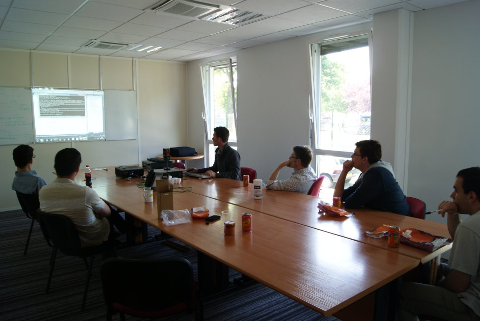

!SLIDE subsection
# Retour d'experience

!SLIDE
# Managers heureux
## Ouverture du premier Dojo aux autres projets

!SLIDE
# Développeurs heureux
## Encore plus soudés
.notes TODO

!SLIDE
# Sujets
## Puzzles
### Chiffres Romains, Pseudo-OCR, etc  
## Découvertes
### Android, Windows Phone, F# 
### Electronique Open source en .Net
### etc
## Outillage pour le projet

!SLIDE subsection
# Conseils

!SLIDE bullets incremental
# Choix du sujet par vote
* Accepter que son sujet ne soit pas retenu
* En avoir au moins un sous le coude

!SLIDE bullets incremental
# A la vitesse du plus lent
* Prévenir dès que l'on ne comprends pas

!SLIDE bullets incremental
# Durée des cycles en Randori
* 5 minutes trop court
* 7 minutes bien

!SLIDE
# Feedback en fin de session

!SLIDE bullets incremental
# &#8220; Les autres vont ils suivrent ? &#8221;
* Se lancer
* Inclure tous le monde

!SLIDE center

!SLIDE bullets incremental
# Régularité
* Entraînement
* Importance d'avoir un porteur au début