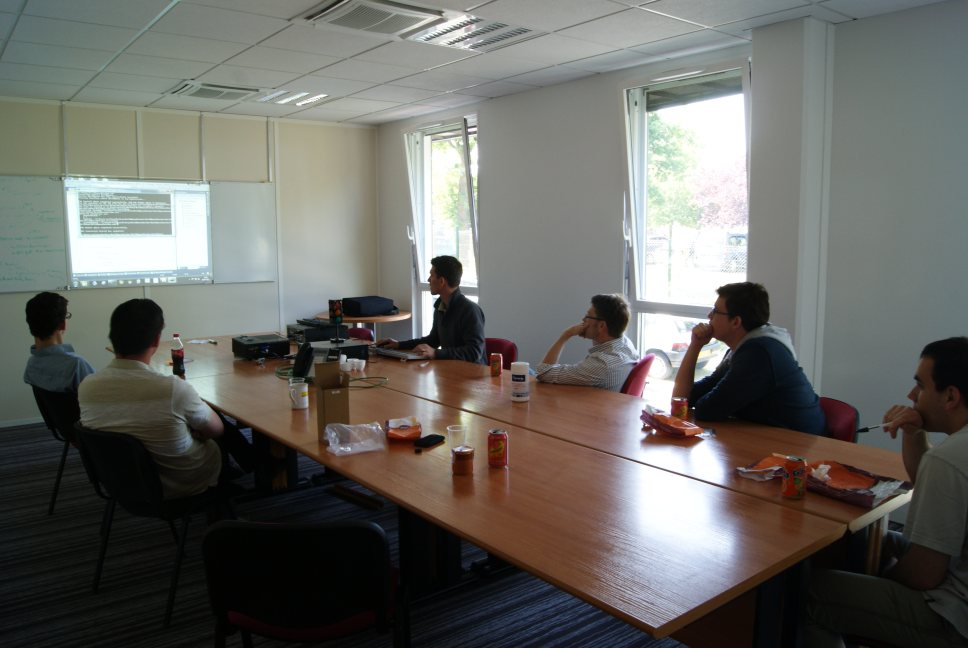

!SLIDE subsection
# Organisation

!SLIDE bullets incremental
# Avant
* salle + vidéo projecteur
* avoir au moins un sujet sous le coude
* sandwitch?

!SLIDE bullets incremental
# Choix du sujet par vote
* Accepter que son sujet ne soit pas retenu

!SLIDE bullets incremental
# A la vitesse du plus lent
* Prévenir dès que l'on ne comprends pas

!SLIDE bullets incremental
# Durée des cycles en Randori
* < 10 minutes
* 7 minutes ?

!SLIDE bullets incremental
# Feedback en fin de session
* Qu'est ce qu'on a appris aujourd'hui ?
* Est-ce que c'était fun ?

!SLIDE bullets incremental
# Régularité
* Entraînement (1 fois par an ?)

!SLIDE bullets incremental
# &#8220; Les autres vont ils suivrent ? &#8221;
* Se lancer
* Inclure tous le monde

!SLIDE center
